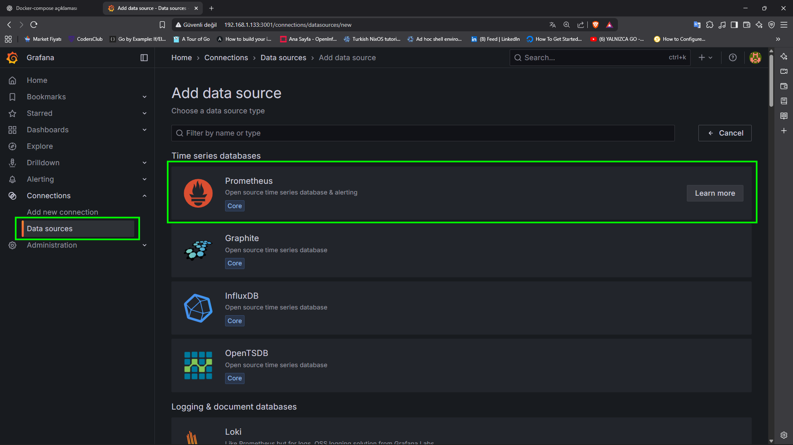
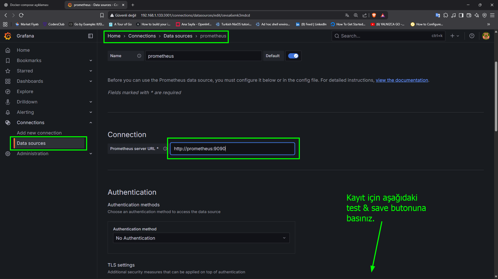
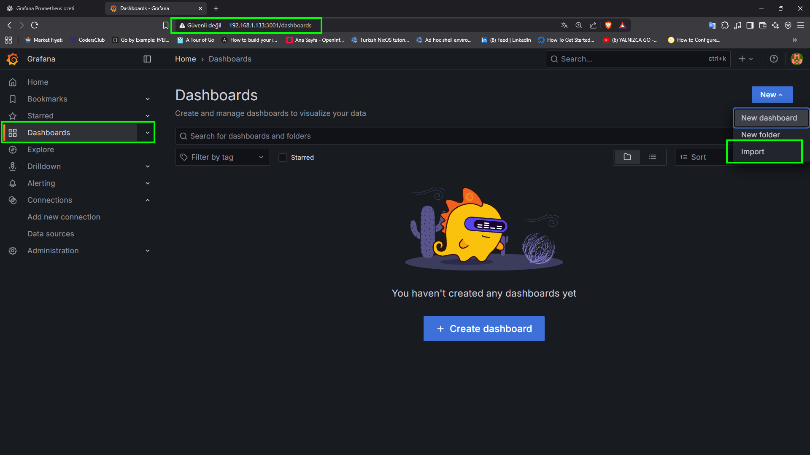
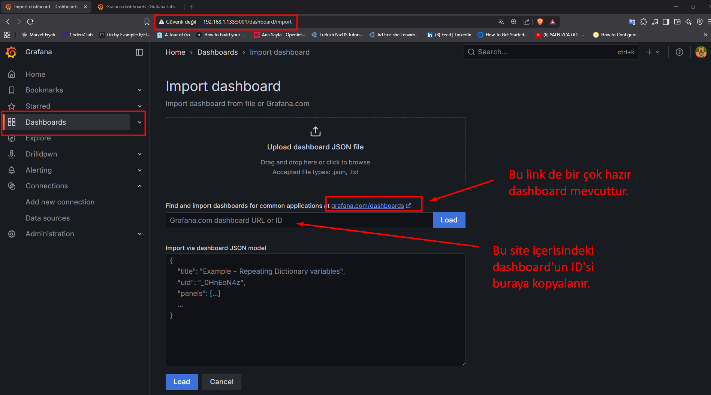
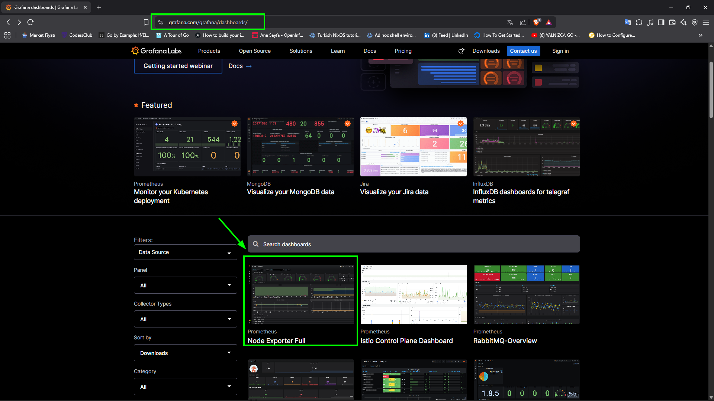

# Grafana - Prometheus ve Docker Compose

+ Cihazları izlemek inanılmaz derecede önemlidir çünkü reaktif olmaktansa proaktif olmak bizim çıkarımızadır. 
+ Örneğin, bir sabit diskin kapasitesinin 70'e ulaştığını bilmek, bir bilgisayarın disk alanı dolduğu için çalışmayı durdurduğunu öğrenmekten daha iyidir.
+ Şu anda kullanabileceğiniz birçok izleme aracı var. Ücretsiz olarak kullanılabilen ilginç bir açık kaynak kombinasyonu Prometheus ve Grafana'dır. 
+ **Peki Prometheus ve Grafana'yı Docker'a nasıl kurarsınız?**


> [!CAUTION]
> + Bu video özellikle Prometheus ve Grafana kurulumuyla ilgili olduğundan Docker kurulumunuzun zaten mevcut olduğunu varsayacağım.

## 1. Node Exporter Kurulumu:

+ Prometheus'un gerçek bir cihazdan ölçümleri toplayabilmesi için bir `exporter` erişmesi gerekiyor.
+ Bu(`exporter), bilgisayardaki bilgilerin sunulabilir bir formatta sunulmasını sağlayacaktır.
+ Prometheus'un gerçek bir cihazdan ölçümleri toplayabilmesi için bir `exporter` erişmesi gerekiyor. 
+ Bu sayede bilgisayardaki bilgiler sunulabilir bir formatta erişilebilir olacak ve Prometheus düzenli olarak bu `exporter` kontrol edecek ve o anda ölçümleri toplayacak.

> [!TIP]
> + Bu lab'da kullanacağımız makine hakkında bilgiler aşağıda mevcuttur:
> ```shell
> cat /etc/os-release
> ```
> + Komut Çıktıs:
> ```shell
> PRETTY_NAME="Ubuntu 22.04.5 LTS"
> NAME="Ubuntu"
> VERSION_ID="22.04"
> VERSION="22.04.5 LTS (Jammy Jellyfish)"
> VERSION_CODENAME=jammy
> ID=ubuntu
> ID_LIKE=debian
> HOME_URL="https://www.ubuntu.com/"
> SUPPORT_URL="https://help.ubuntu.com/"
> BUG_REPORT_URL="https://bugs.launchpad.net/ubuntu/"
> PRIVACY_POLICY_URL="https://www.ubuntu.com/legal/terms-and-policies/privacy-policy"
> UBUNTU_CODENAME=jammy
> ```

**Çalışma Dizini:**

```shell
mkdir grafana-prometheus; cd grafana-prometheus
```


```shell
vim docker-compose.yml
```

**docker-composer.yml**

```yaml
# version: '3.8'

services:
  node_exporter:
    image: quay.io/prometheus/node-exporter:latest
    container_name: node_exporter
    command:
      - '--path.rootfs=/host'
    network_mode: host
    pid: host
    restart: unless-stopped
    volumes:
      - '/:/host:ro.rslave'
```

> + `services` → 
> 	- **services:** başlığı altında, çalıştırmak istediğin her bir container (yani servis) tanımlanır.
> 	- Her servis için hangi imajın kullanılacağı, hangi portların açılacağı, hangi volume’lerin bağlanacağı, hangi ortam değişkenlerinin verileceği gibi ayarlar yapılır.
> + `node_exporter` → 
> 	- Tek bir servis tanımlanıyor: `node_exporter`.
> + `image: quay.io/prometheus/node-exporter:latest` → 
> 	- **Kullanılacak imaj:** `quay.io` üzerinden resmi `node-exporter` imajı.
> 	- `latest` etiketi en güncel sürümü çeker.
> + `container_name: node_exporter` → 
> 	- Container’ın ismi `node_exporter` olarak sabitlenir.
> 	- Böylece otomatik üretilen uzun isim yerine bu isimle yönetebilirsin.
> + `--path.rootfs=/host` → 
> 	- Node Exporter’ın çalıştırılma parametresi.
> 	- Container içinden host’un kök dizinini (`/`) `/host` olarak bağlar ve metrikleri oradan okur.
> 	- Bu, container’ın **host sistemin gerçek disk, CPU, ağ bilgilerini** görmesini sağlar.
> + `network_mode: host` → 
> 	- Container, host ile **aynı ağ yığını**nı kullanır.
> 	- Yani `localhost:9100` üzerinden erişebilirsin (node-exporter varsayılan portu 9100).
> 	- Performans avantajı vardır ama **ağ izolasyonu olmaz**.
> + `restart: unless-stopped` → 
> 	- Container durursa veya Docker yeniden başlarsa **otomatik yeniden başlatılır**.
> 	- Manuel olarak durdurursan (`docker stop`), tekrar başlamaz.
> + `'/:/host:ro.rslave'` → 
> 	- Host’un kök dizini (`/`) container içinde `/host` olarak bağlanır. 
> 	- `ro` → Sadece okunabilir (read-only).
> 	- `rslave` → Bind mount için "propagation" modu; alt mount değişiklikleri container’a yansır ama tersi olmaz.
> 	- Bu, özellikle sistemde yeni diskler takıldığında Node Exporter’ın görmesini sağlar.

+ `docker-compose.yml` dosyası ile varsayılan olarak oluşturulmuş ağ aşağıdaki çıktıda görülmektedir.

```shell
docker network ls
```

**docker network Çıktısı:**

```shell
NETWORK ID     NAME                         DRIVER    SCOPE
ba40dbe38f73   bridge                       bridge    local
84c593bda56d   grafana-prometheus_default   bridge    local
3f1accc84fb6   host                         host      local
4bff012255f4   none                         null      local
```

> `grafana-prometheus_default` ağı varsayılan  olarak `docker-compose.yml` dosyası tarafından oluşturulmuştur.

> [!CAUTION]
> + Eğer `docker-compose.yml` dosyanda **hiçbir özel network tanımı yapmazsan**, Docker Compose otomatik olarak bir network oluşturur.
> ```yaml
> <proje_adı>_default
> ```
> + projenin adı `grafana-prometheus` olduğu için network adı `grafana-prometheus_default` olmuştur.
> + **Driver:** 
> 	- Varsayılan olarak `bridge` network sürücüsünü kullanır. Bu, konteynerlerin aynı host üzerinde izole bir ağ ortamında birbirleriyle haberleşebilmesini sağlar.
> + **Amaç:**
> 	- Compose içindeki tüm servislerin (Grafana, Prometheus vb.) aynı network üzerinde olmasını sağlar, böylece birbirlerine container adları üzerinden erişebilirler.
> 	- Örneğin Grafana, Prometheus’a `http://prometheus:9090` şeklinde ulaşabilir.
> + **Oluşma zamanı:**
> 	- `docker compose up` veya `docker-compose up` komutu çalıştırıldığında network varsa kullanılır, yoksa otomatik olarak oluşturulur.
> + **Silinmesi:**
> 	- `docker compose down` komutunu verdiğinde bu varsayılan network de kaldırılır (eğer başka bir container kullanmıyorsa).

#### Node Exporter Çalışma Mantığı:

1. Host’un CPU, RAM, disk, ağ, I/O, filesystem gibi metriklerini toplar.
2. Prometheus’a veri sunar (`http://<host-ip>:9100/metrics`).
3. Host sistemde direkt çalışıyormuş gibi davranır, çünkü hem `network_mode: host` hem `pid: host` hem de kök dizin mount edilmiş.


> [!NOTE]
> #### `--path.rootfs=/host` nedir?
> + Node Exporter normalde **çalıştığı ortamın** (container’ın içinin) dosya sistemini ve sistem bilgilerini okur.
> + Ama biz onu bir Docker container’ında çalıştırdığımız için, default olarak sadece container’ın kendi izole edilmiş rootfs’ini görebilir.
> + **Sorun:**
> 	- Bu durumda Node Exporter, **host makinenin** gerçek disk, CPU, ağ gibi metriklerini değil, container’ın sınırlı ortamını görür.
> + **Çözüm:**
> 	+ Host’un kök dizinini (`/`) container içine bind-mount ile `/host` olarak bağlarız:
> 	```yaml
> 	volumes:
> 	 - '/:/host:ro,rslave'
> 	```
> 	+ Sonra Node Exporter’a “sen root dosya sistemi olarak `/host` dizinine bak” deriz:
> 	```yaml
> 	--path.rootfs=/host
> 	```
> #### `--path.rootfs` Parametresinin İşlevi:
> + **Standart kullanım:** Node Exporter, `/proc`, `/sys`, `/etc/mtab` gibi yolları okuyarak sistem bilgilerini toplar.
> + **Bu parametreyle:** Bu yolların host tarafındaki versiyonlarını okur, çünkü `/host` altında host’un gerçek dosya sistemi var.
> + Yani;
> 	- Normalde `/proc` → container’ın kendi süreç tablosu
> 	- `--path.rootfs=/host` ile `/proc` → host’un süreç tablosu (`/host/proc` üzerinden)
> + Bu sayede container, **host’ta çalışan bütün process’leri ve mount edilmiş bütün diskleri** görebilir.
> #### Güvenlik ve İzinler:
> + `ro` (read-only) mount kullanılması kritik, aksi halde container host’un dosya sistemini değiştirebilir.
> + Yine de bu parametre, container’a çok geniş okuma yetkisi verir.
> + Eğer yetkisiz biri container’a komut çalıştırabilirse, host sistem hakkında çok bilgi toplayabilir.
> #### Nasıl Çalışıyor?
> ```yaml
> volumes:
>   - '/:/host:ro.rslave'
> command:
>   - '--path.rootfs=/host'
> ```
> + Bu iki satır bir paket gibi çalışıyor:
> 	1. **Mount:** Host’un `/` kök dizini container içindeki `/host` olarak bağlanır.
> 	2. **Parametre:** Node Exporter’a “rootfs = `/host`” denir.
> 	3. **Sonuç**: Node Exporter, host’un gerçek donanım ve işletim sistemi metriklerini dışarıya `/metrics` endpoint’inden sunar.


> [!NOTE]
> #### `docker-compose` içinde `command` nedir?
> + `command:` alanı, container başlatıldığında **varsayılan çalıştırma komutunu** ya da **argümanlarını** belirler.
> 	- Her Docker imajının içinde bir **ENTRYPOINT** ve opsiyonel **CMD** tanımı vardır (Dockerfile’da yazılır).
> 	- `command:` ile bu **CMD** kısmını değiştirmiş olur.
> + Örneğin:
> ```yaml
> command: ["arg1", "arg2"]
> ```
> veya
> ```yaml
> command:
>   - "arg1"
>   - "arg2"
> ```
> + Bu, container’ın çalışırken **ENTRYPOINT**’ine bu argümanları verir.
> + Bu `docker-compose.yml` dosyasında
> ```yaml
> command:
>  - '--path.rootfs=/host'
> ```
> + Bu demek oluyor ki, `Node Exporter` imajının kendi varsayılan komutuna (`/bin/node_exporter`) bu ek parametre veriliyor.


> [!NOTE]
> #### `network_mode: host` Nedir?
> + Normalde her Docker container kendi **izole edilmiş sanal ağında(default brigde)** çalışır.
> + Bu izolasyon sayesinde:
> 	- Container’ın kendi IP’si olur (örn. `172.18.x.x`)
> 	- **Dış dünyaya ancak port yönlendirmesi (`ports:`) ile erişirsin.**
> + `network_mode: host` dediğinde ise:
> 	- Container, **host makinenin ağ yığınını doğrudan kullanır**.
> 	- Yani container’ın ayrı bir IP’si olmaz, host ile aynı IP’yi paylaşır.
> 	- Port yönlendirmeye gerek kalmadan host üzerindeki portları kullanabilir.
> #### Avantajları:
> 1. **Port yönlendirme yok**
> 	```yaml
> 	ports:
> 	  - "9100:9100"
> 	```
> 	+ yazmana gerek yok. Çünkü `localhost:9100` doğrudan host üzerinden çalışır.
> 2. **Düşük ağ gecikmesi**
> 	+ Virtual network katmanından geçilmediği için performans artar.
> 3. **Servis keşfi kolay**
> 	+ Bazı monitoring araçları veya servisler, host IP’sinden yayın yapmaları gerektiğinde bu mod daha kolay olur.
> #### Dezavantajları / Riskler
> +  **Ağ izolasyonu yok**
> 	- Container doğrudan host’un tüm ağ arayüzlerine erişir.
> 	- Yanlış yapılandırılırsa güvenlik açığı oluşur.
> + **Port çakışması riski**
> 	- Host’ta bir port zaten kullanımda ise container o portu dinleyemez.
> + **Cross-container iletişim** zorlaşır
> 	- Çünkü host mode’da çalışan container’lar, Docker’ın internal bridge ağına dahil olmaz.
> #### Node Exporter Neden Kullanılmış?
> + Node Exporter genellikle **9100** portunda çalışır ve Prometheus bu porta erişir.
> + Burada `network_mode: host` kullanılmasının sebebi:
> 	1. Node Exporter’ın **host’un gerçek ağ arayüzleri üzerinden** yayın yapması.
> 	2. Prometheus’un, container yerine host IP’sinden metrik toplaması.
> 	3. Port yönlendirmesi (`ports`) yazmak zorunda kalmamak.


> [!NOTE]
> #### `pid: host` Nedir?
> + Docker container’ları normalde kendilerine özel bir process namespace’e sahiptir.
> 	- Yani `ps aux` çalıştırırsan, sadece container’ın içindeki process’leri görürsün.
> 	- Host’taki process’leri göremezsin.
> + `pid: host` dediğinde:
> 	- Container, **host’un process namespace**’ini kullanır.
> 	- Yani container’ın içinden host’taki **tüm process’ler** (`PID 1` dahil) görülebilir.
> 	- `top` veya `ps aux` çalıştırırsan, host’un tüm çalışan servislerini listeler.
> #### Node Exporter’da Neden Kullanılır?
> + Node Exporter, bazı metrikleri toplarken process bilgilerini de okumak ister (örn. CPU, bellek kullanımını process bazlı görmek için).
> + `pid: host` olmadan container, sadece kendi içindeki izole PID’leri görür → bu durumda metrikler eksik olur.
> + `pid: host` ile tüm host process’leri görülebilir.


> [!NOTE]
> `docker-compose.yml`’da **ikisi birlikte** var:
> ```yaml
> network_mode: host
> pid: host
> ```
> 1. **network_mode: host** → Container, host ile aynı IP ve ağ arayüzlerini kullanır.
> 2. **pid: host** → Container, host’un process tablosunu paylaşır.
> + yani;
> 	- Node Exporter hem host’un ağ trafiğini, hem de tüm process’lerini, disklerini, CPU’sunu görebilir.
> 	- İzolasyon neredeyse yoktur; container **host üzerinde native çalışıyormuş gibi** davranır.


> [!WARNING]
> + Bu kombinasyon, monitoring ve debugging için çok güçlüdür ama güvenlik açısından risklidir:
> 	- Container’ı çalıştıran kullanıcı, host’ta process bilgilerini görebilir (örn. çalışmakta olan servisler, komut satırı argümanları, environment değişkenleri).
> 	- Eğer container’a **root yetkisi** verilmişse (örn. `--privileged`), bu kombinasyon host’a doğrudan müdahale imkânı sağlayabilir.


> [!TIP]
> + Eğer node_exporter container'ın süreçleri(`processes`) ile host'un süreçleri aşağıdaki komutlar ile karşılaştırsak;
> + docker içindeki süreçler;
> ```shell
> docker exec -it node_exporter ps aux | head
> ``` 
> + host içindeki süreçler;
> ```shell
> ps aux | head
> ```
> + Ekrana basılan süreçlerin aynı olduğunu göreceksiniz.

#### `docker run` Komutuna Çevirme:

+ `node_exporter` servisini `docker run` **tek satırlık bir `docker run` komutuna** çevirecek olursak, aşağıdaki gibi olur:

```shell
docker run -d \
  --name node_exporter \
  --network host \
  --pid host \
  --restart unless-stopped \
  -v /:/host:ro,rslave \
  quay.io/prometheus/node-exporter:latest \
  --path.rootfs=/host
```

> + `-d` → Arka planda (detached) çalıştırır.
> + `--name node_exporter` → Container’ın adını `node_exporter` yapar.
> + `--network host` → `network_mode: host` karşılığı.
> + `--pid host` → Host’un process namespace’ini paylaşır.
> + `--restart unless-stopped` → Compose’daki restart politikasını aynen uygular.
> + `-v /:/host:ro,rslave` → Host’un root dizinini `/host` olarak mount eder (read-only, rslave).
> + `quay.io/prometheus/node-exporter:latest` → Kullanılacak imaj.
> + `--path.rootfs=/host` → Node Exporter’ın host metriklerini okuması için gerekli parametre.

> [!NOTE]
> + Burada dikkat etmen gereken şey, `docker run` komutunda:
> 	- Compose’daki **`command:`** kısmındaki parametreler (`--path.rootfs=/host`) **imaj adından sonra** yazılır.
> 	- Compose’daki **`volumes:`**, **`network_mode:`**, **`pid:`**, **`restart:`** gibi ayarlar doğrudan `docker run` parametreleriyle karşılanır.


#### Node Exporter Metrik Verileri:

+ Bu container çalıştıktan sonra, host üzerinde:

```shell
curl -s http://localhost:9100/metrics
```

> + komutu ile Node Exporter’ın ürettiği metrikleri görebilirsin.

---

+ Tarayıcı üzerinden de metrik veriler ulaşabilirsiniz:


#### Metrik Veriler Host'a mı Ait?


> [!CAUTION]
> +  **Soru:** Çekilen veriler host'ta mı ait yoksa container'a ait mi olduğunu nasıl anlarız?

+ Bunu kanıtlamak için en basit yöntem, `http://<host-ip>:9100/metrics` adresindeki veriler ile **host üzerinde çalışan gerçek sistem değerlerini** karşılaştırmaktır.


> [!NOTE]
> ##### CPU veya Load Average Karşılaştırması
> + Node Exporter metriklerinde şu değerleri görebilirsin:
> ```shell
> curl -s http://192.168.1.133:9100/metrics | grep node_load
> ```
> + Host’ta şu komutu çalıştır:
> ```shell
> uptime
> ```
> veya
> ```shell
> cat /proc/loadavg
> ```
> + Eğer değerler **birebir aynı** ise, exporter host’tan veri topluyor demektir.
> + Container’dan veri alsaydı, load değerleri çok düşük olurdu (çünkü container içinde genelde az process çalışır).


> [!NOTE]
> ##### Host’a Özel Disk Bilgileri Karşılaştırması
> + Aşağıdaki komut çıktısı bu device adı (`/dev/nvme0n1p2` gibi) ve disk boyutu **host’un gerçek disk bilgisi** ile aynı olmalıdır.
> ```shell
>  curl -s http://192.168.1.133:9100/metrics | grep node_filesystem
> ```
> + Host'ta `lsblk` veya `df -h` komut çıktıları; 
> 	- Çıkan cihaz isimleri ve boyutları metriklerle eşleşiyorsa, bu host verisidir.
> 	- Container’ın kendi overlay filesystem’i böyle görünmez.


> [!NOTE]
> + Aşağıdaki komut çıktısı, buradaki `enp3s0`, `eth0` gibi değerler **host’un gerçek ağ arayüzü isimleri**dir.
> + Container kendi ağında olsaydı genelde sadece `eth0@if42` görünürdü ve IP’si bridge ağına ait olurdu.
> ```shell
> curl -s http://192.168.1.133:9100/metrics | grep node_network
> ```
> + Host'ta
> ```shell
> ip link show
> ```
> + Eğer arayüz isimleri birebir uyuyorsa → host verisi.


> [!TIP]
> ##### Özet Kanıtlama Mantığı
> + Host mod (`network_mode: host`) + PID mod (`pid: host`) + rootfs mount (`--path.rootfs=/host`) sayesinde Node Exporter container **host’un kaynaklarını doğrudan okur**.
> + Yukarıdaki 4 testten **herhangi biri** uyuyorsa, %100 host verisi geldiği kanıtlanır.


## 2. prometheus.yml Oluşturma:

```shell
mkdir prometheus;
```

**Çalışma Dizinimizin Son Hali:**

+ Bizim mevcuttaki çalışma dizinimiz
+ `grafana-prometheus` adında bir klasörün dizin yapısı (Komut: `tree grafana-prometheus`)

```shell
grafana-prometheus
├── docker-compose.yml
└── prometheus
    └── prometheus.yml

2 directories, 2 files
```


```shell
vim prometheus/prometheus.yml
```

**prometheus.yml**

+ Şimdi bunlar aslında iki ayrı konteyner olarak çalışıyor, yani Prometheus'u çalıştıran bir konteynerimiz var ve sonra node_exporter'ımızı çalıştıran başka bir konteynerimiz var.
+ Bundan dolayı 2 tane `job` yazılmıştır. 

```shell
global:
  scrape_interval: 1m

scrape_configs:
  - job_name: 'prometheus'
    static_configs:
      - targets: ['localhost:9090']
  - job_name: 'node'
    static_configs:
      - targets: ['192.168.1.133:9100']
```

> 1. **`scrape_interval`** →
> 	+ Prometheus’un metrik toplama (scraping) sıklığını belirler.
> 	+ Burada `1m` yani **1 dakikada bir** belirtilen hedeflerden (targets) metrik alınacak.
> 	+ Bu değer tüm job’lar için **varsayılan** olarak geçerlidir, ama istenirse her job için ayrı `scrape_interval` tanımlanabilir.
> 2. `scrape_configs` → 
> 	+ Prometheus’un hangi hedeflerden veri toplayacağını (scrape edeceğini) tanımlar.
> 	+ Her bir **`job_name`**, farklı bir veri toplama görevidir.
> 3. `job_name: prometheus` → 
> 	+ Bu job’a verilen isim, metriklerde `job="prometheus"` etiketi olarak görünür.
> 4. `static_configs` → 
> 	+ Hedefler statik (elle) tanımlanıyor.
> 5. `target` → 
> 	+ Burada hedef **`localhost:9090`**, yani Prometheus kendi çalıştığı endpoint’ten veri alıyor.
> 	+ Bu endpoint (`http://localhost:9090/metrics`) Prometheus’un kendi durumunu, hafıza kullanımını, sorgu istatistiklerini içerir.
> 6. `job_name: 'node'` → 
> 	+ Bu job’un ismi, metriklerde `job="node"` etiketi olur.
> 7. `targets` → 
> 	+ `192.168.1.133:9100` adresindeki **Node Exporter**’dan metrik toplanacak.
> 	+ Node Exporter, sistemin CPU, RAM, disk, network gibi **donanım ve işletim sistemi** metriklerini sağlar.

## 3. Prometheus Kurulumu:

**docker-compose.yml**

```yaml
# version: '3.8'

volumes:
  prometheus-data:

services:
  node_exporter:
    image: quay.io/prometheus/node-exporter:latest
    container_name: node_exporter
    command:
      - '--path.rootfs=/host'
    network_mode: host
    pid: host
    restart: unless-stopped
    volumes:
      - '/:/host:ro.rslave'

  prometheus:
    image: prom/prometheus:latest
    container_name: prometheus
    ports:
      - '9091:9090'
    restart: unless-stopped
    volumes:
      # Bind Mount
      - ./prometheus/prometheus.yml:/etc/prometheus/prometheus.yml
      # Named Volume
	  - prometheus-data:/prometheus
    command:
      - '--web.enable-lifecycle'
      - '--config.file=/etc/prometheus/prometheus.yml'
```

> 1. `prometheus` → 
> 	- İkinci bir servisi tanımlanıyor: `prometheus`
> 2. `image: prom/prometheus:latest` → 
> 	- Prometheus’un en son resmi imajını Docker Hub’dan çeker (`prom/prometheus:latest`).
> 3. `container_name: prometheus` → 
> 	- Container’a kolay erişim için özel isim veriyor (`prometheus`).
> 	- Böylece `docker logs prometheus` gibi kolay komutlar kullanılabilir.
> 4. `'9091:9090'` → 
> 	- **Host portu 9091** → **Container içindeki port 9090** olarak eşleniyor.
> 	- Prometheus’un web arayüzü ve API’si bu port üzerinden çalışır.
> 	- Tarayıcıdan `http://localhost:9091` ile erişebilirsin.
> 5. `restart: unless-stopped` → 
> 	- Docker daemon yeniden başlarsa veya container çökerse otomatik olarak yeniden başlatır.
> 	- **Manuel olarak `docker stop` komutu ile durdurursan tekrar başlatmaz**.
> 6. `./prometheus/prometheus.yml:/etc/prometheus/prometheus.yml` → 
> 	- Host’taki `prometheus.yml` konfigürasyon dosyasını container içine bağlar.
> 	- Böylece konfigürasyonu dışarıdan yönetebilirsin.
> 7. `prometheus-data:/prometheus` →
> 	- Named volume (kalıcı depolama - persistent stores) ile Prometheus’un zaman serisi verilerini saklar.
> 	- Container silinse bile metrik veriler kaybolmaz.
> 8. `--web.enable-lifecycle` → 
> 	- Prometheus’a çalışma sırasında yeniden yükleme (`/-/reload`) özelliği kazandırır.
> 	- Örneğin; `curl -X POST http://localhost:9090/-/reload` ile konfigürasyonu yeniden yükleyebilirsin.
> 9. `--config.file=/etc/prometheus/prometheus.yml` →
> 	- Prometheus’un hangi konfigürasyon dosyasını kullanacağını belirtir (burada bind edilen dosya).


> [!NOTE]
> ```yaml
> volumes:
>   prometheus-data: {}
> ```
> + satırı **Prometheus servisine ait** olan kalıcı depolamayı (persistent volume) tanımlıyor.
> #### Ne İşe Yarar:
> - Docker container’ları silindiğinde normalde içindeki veriler de silinir.
> - **Named volume** kullanarak verileri container’ın yaşam süresinden bağımsız saklarsın.
> - Burada `prometheus-data` adında bir named volume tanımlanmış.
> - `docker volume ls` komutu ile listelenir, `docker volume inspect prometheus-data` ile detaylarına bakılabilir.
> - Prometheus container’ında `/prometheus` klasörüne bağlanıyor:
> ```yaml
> volumes:
>   - prometheus-data:/prometheus
> ```
> #### Avantajı:
> 1. Container silinse bile veriler `prometheus-data` volume’ünde kalır.
> 2. Yeniden container oluşturduğunda aynı verileri görebilirsin.
> 3. Prometheus için bu çok önemli çünkü metrik geçmişinin kaybolmasını engeller.


> [!TIP]
> #### A. Boş süslü parantez (`{}`) ile yazmak
> ```yaml
> volumes:
>   prometheus-data: {}
> ```
> + Burada `prometheus-data` **explicit (açıkça)** boş bir sözlük (dictionary) olarak tanımlanıyor.
> + Yani Docker Compose'a “bu bir named volume ve şu an için hiçbir ek ayarı yok” demiş oluyorsun.
> + İlerde bu kısma opsiyon ekleyebilirsin:
> ```yaml
> prometheus-data:
>   driver: local
>   driver_opts:
>     type: none
>     device: /path/to/data
>     o: bind
> ```
> #### B. Sadece isim yazarak (`:`) bırakmak
> ```yaml
> volumes:
>   prometheus-data:
> ```
> + YAML bunu da **null değerli** bir anahtar olarak algılar.
> + Docker Compose tarafında yine **varsayılan volume ayarlarıyla** oluşturulur.
> + Aslında `prometheus-data: null` ile aynı şeydir.
> ##### 📌 Fark var mı?
> + **Davranış farkı yok** → Docker Compose ikisinde de aynı şekilde varsayılan sürücü (`local`) ile volume oluşturur.
> + Tek fark **açıklık ve stil farkı**:
> 	- `{}` → açıkça “boş bir ayar sözlüğü” olduğunu gösterir, gelecekte ayar eklenebilir.
> 	- Boş bırakmak → kısa ve sade, ama ayar eklemek istersen altına indent ile eklemen gerekir.

### docker run Komutuna Çevirme:

```shell
docker run -d \
  --name prometheus \
  -p 9091:9090 \
  --restart unless-stopped \
  -v $(pwd)/prometheus/prometheus.yml:/etc/prometheus/prometheus.yml \
  -v prometheus-data:/prometheus \
  prom/prometheus:latest \
  --web.enable-lifecycle \
  --config.file=/etc/prometheus/prometheus.yml
```

> + `-d` → arka planda çalıştırır.
> + `--name prometheus` → Container’ın adını `prometheus` yapar.
> + `-p 9091:9090` → host:container port eşleştirir.
> + `--restart unless-stopped` → Eğer manual olarak durdurulmadıysa otomatik olarak yeniden başlatılır.
> + `-v $(pwd)/prometheus/prometheus.yml:/etc/prometheus/prometheus.yml` → bind mount (config dosyasını host’tan container’a bağlıyoruz).
> + `-v prometheus-data:/prometheus` → named volume (Prometheus metrik verilerini kalıcı depolama için).
> + `prom/prometheus:latest` → kullanılacak image.
> + `--web.enable-lifecycle --config.file=/etc/prometheus/prometheus.yml` → container içindeki Prometheus’a geçilecek parametreler.


```shell
docker volume create prometheus-data
```

## 4. URL ile Yeniden Yükleme:

+ Prometheus’te gördüğün `--web.enable-lifecycle` parametresi, **Prometheus’un HTTP üzerinden yeniden yükleme (reload) ve kapatma (shutdown) gibi yaşam döngüsü (lifecycle) işlemlerine izin vermesini** sağlar.
+ Normalde Prometheus başlatıldıktan sonra `prometheus.yml` dosyasında yaptığın değişiklikler otomatik olarak yüklenmez. 
+ Bunun için iki yöntem vardır:
	1. Prometheus’u tamamen yeniden başlatmak → Eski yöntem ama kesinti yaratır.
	2. HTTP endpoint üzerinden yeniden yükleme (`reload`) yapmak → Daha modern ve kesintisiz yöntem.


> [!NOTE]
> `--web.enable-lifecycle` parametresi aktif edilirse, Prometheus şu endpointleri açar:
> 1. `POST /-/reload` → Konfigürasyon dosyalarını (ör. `prometheus.yml`) Prometheus’u yeniden başlatmadan **yeniden yükler**.
> ```shell
> curl -X POST http://localhost:9090/-/reload
> ```
>
> 2. `POST /-/quit` → Prometheus sürecini **düzgün bir şekilde sonlandırır**.
> 3. `POST /-/quit?graceful=true` → Hedeflere bağlanmayı sonlandırır, metrikleri diske yazar ve ardından kapanır. 

+ `POST /-/reload` isteği atığımızda **işlemin başarılı** olup olmadığını aşağıdaki çıktıdan görebiliriz:


+ Eğer `timedatectl` komut çıktısını `Last Successful Configuration Reload` ile karşılaştırdığımızda aynı olduğunu görebiliriz:

```shell
timedatectl status
```

`timedatectl` çıktısı: 

```shell
               Local time: Thu 2025-08-21 15:53:02 +03
           Universal time: Thu 2025-08-21 12:53:02 UTC
                 RTC time: Thu 2025-08-21 12:51:58
                Time zone: Asia/Istanbul (+03, +0300)
System clock synchronized: yes
              NTP service: active
          RTC in local TZ: no
```

## 5. Grafana Kurulumu:

+ Prometheus'un tüm bu metrikleri toplaması güzel ve hoş ama bunları daha sunulabilir formatlarda görmek istiyoruz.
+ Bunları bir gösterge panelinde görmek istiyoruz ve  bunların grafiklerini görmek istiyoruz vb. ve işte Grafana tam da bu noktada devreye giriyor.
+ Bunu Docker'da başka bir konteyner olarak kuracağız.

```yaml
# version: '3.8'

volumes:
  prometheus-data:
  grafana-data: {}

services:
  node_exporter:
    image: quay.io/prometheus/node-exporter:latest
    container_name: node_exporter
    command:
      - '--path.rootfs=/host'
    network_mode: host
    pid: host
    restart: unless-stopped
    volumes:
      - '/:/host:ro.rslave'

  prometheus:
    image: prom/prometheus:latest
    container_name: prometheus
    ports:
      - '9091:9090'
    restart: unless-stopped
    volumes:
      # Bind Mount
      - ./prometheus/prometheus.yml:/etc/prometheus/prometheus.yml
      - /etc/localtime:/etc/localtime:ro
      - /etc/timezone:/etc/timezone:ro
      # Named Volume
      - prometheus-data:/prometheus
    command:
      - '--web.enable-lifecycle'
      - '--config.file=/etc/prometheus/prometheus.yml'

  grafana:
    image: grafana/grafana:latest
    container_name: grafana
    ports:
      - '3001:3000'
    restart: unless-stopped
    volumes:
      - grafana-data:/var/lib/grafana
```

> 1. `grafana` → 
> 	- `docker-compose.yml` dosyasında bir servis tanımlıyor.
> 	- Servisin adı **grafana** olacak. Bu isim, ağda DNS host adı gibi de davranır (örneğin, diğer servisler `http://grafana:3000` şeklinde erişebilir).
> 2. `image: grafana/grafana:latest` → 
> 	- Kullanılacak Docker imajı: **grafana/grafana**.
> 	- `latest` etiketi her zaman en güncel sürümü çeker. Ancak genelde prod ortamda **sabit bir sürüm etiketi** (örn. `grafana/grafana:10.4.3`) kullanmak önerilir.
> 	- Çünkü `latest` sürüm güncelleme sonrası beklenmedik değişikliklere yol açabilir.
> 3. `container_name: grafana` → 
> 	- Konteynerin adını **grafana** olarak sabitler.
> 	- Eğer bu parametre kullanılmazsa Docker Compose otomatik olarak proje_adı-servis_adı-1 gibi bir isim verir (örn. `myproject_grafana_1`).
> 	- Sabit isim, elle komut verirken veya başka bir konteynerden bağlanırken işleri kolaylaştırır.
> 4. `'3001:3000'` → 
> 	- **Host makinedeki 3001 portunu**, konteyner içindeki **3000 portuna** yönlendirir.
> 	- Grafana'nın varsayılan portu 3000 olduğu için tarayıcıdan erişmek için `http://localhost:3001` veya `http://192.168.1.133:3001` yazılır.
> 	- Soldaki kısım (3001) host portu, sağdaki kısım (3000) container içindeki port.
> 5. `Yeniden başlatma politikası:`
> 	- Konteyner durursa, hata verirse veya sistem yeniden başlarsa otomatik tekrar başlatır.
> 	- **unless-stopped**: Manuel olarak durdurmadığın sürece hep yeniden çalışır.
> 	- Alternatifler:
> 		- `no` (varsayılan): Otomatik başlatmaz.
> 		- `always`: Her durumda yeniden başlatır, manuel stop sonrası bile.
> 		- `on-failure`: Sadece hata koduyla çıkarsa başlatır.
> 6. **Volume bağlama:**
> 	- Host üzerinde **grafana-data** adlı oluşturulmuş **Docker volume**'u ve konteyner içindeki `/var/lib/grafana` dizinine bağlar.(`Named Volume`)
> 	- Grafana’nın tüm ayarları, dashboardlar, kullanıcı bilgileri ve verileri `/var/lib/grafana` altında tutulur. Volume sayesinde:
> 		- Konteyner silinse bile veriler korunur.
> 		- Güncelleme sırasında veri kaybı yaşanmaz.
> 7. **Volume Oluşturma:**
> 	```yaml
> 	volumes:
> 	  grafana-data: {}
> 	```
> 	+ `grafana-data` adında volume oluşturacaktır
> 	+ CLI ile: `docker volume create grafana-data` komutu ile oluşturulur.

## 6. Grafana Yapılandırılması:

+ Şimdiki adımda grafana'yı yapılandırıp Prometheus'a yönlendirmesini yapacağız.



+ Kesinlikle yapmamız gereken şey grafana'yı Prometheus örneğimize yönlendirmektir.




> [!TIP]
> + Eğer dikkat ederseniz Prometheus server URL `http://prometheus:9090` verildiğini görebilirsiniz.
> + docker-compose tarafında varsayılan olarak `brigde` sürücüde `grafana-prometheus_default` ağ oluşturulmuştu.
> + Yeni oluşturulan `bridge` ağlarda container adların üzerinde DNS çözümlenmesi yapılabiliyor. Hata container'ın iç IP adresi değişse bile container adları üzerinde ulaşabiliyoruz.

### 6.1. Dashboard Ekleme:

#### 6.1.1. Hazır Dashboard Ekleme:





 


